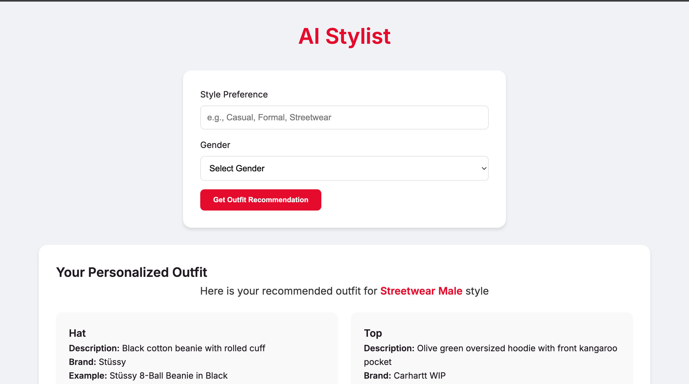
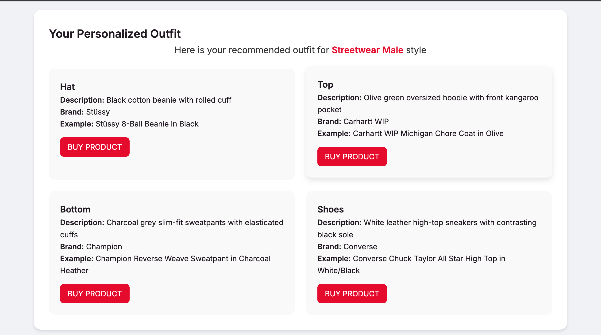

# AI Stylist

## Overview
AI Stylist is your personal digital fashion companion, transforming the way you discover and curate your perfect outfit. Powered by advanced AI, this application provides personalized style recommendations tailored to your unique preferences, gender, and personal style.

## Key Features
- Intelligent Outfit Recommendations
- Personalized Style Matching
- Gender-Specific Fashion Suggestions
- Direct Product Links

## How It Works
Simply input your style preferences and gender, and AI Stylist will:
- Analyze your fashion profile
- Generate curated outfit recommendations
- Provide direct links to purchase recommended items

## Technologies
- Python
- HuggingFace Inference endpoint for Mixtral-8x7B-Instruct-v0.1 model
- SerpAPI

## Getting Started
1. Clone the repository
2. Install dependencies: `pip install -r requirements.txt`
3. Get a HuggingFace token & a SerpAPI key
4. Run the application: `python app.py`

## Demo

